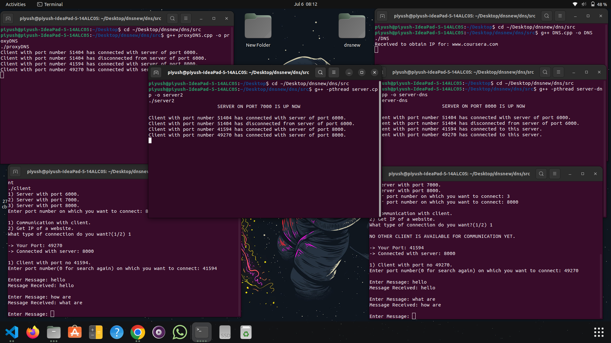

# DNS-Based Client-Server Communication System

This project simulates a DNS-based communication system using TCP sockets in C++.  
It supports communication between multiple clients and servers with a ProxyDNS and DNS resolver layer.

---

## 💡 Features

- Multiple clients can connect to multiple servers.
- Proxy DNS handles routing and message forwarding.
- DNS Server responds with IP addresses for websites.
- Clients can:
  - Communicate with other clients.
  - Request IP of websites like Google, Amazon, Coursera, etc.
- Support for marking clients as available.
- Domain-to-IP mapping loaded from a configurable `ips.txt` file.

---

## 🧱 Architecture Overview

```
Client
  │
  ▼
Server (6000 / 7000 / 8000)
  │
  ▼
ProxyDNS
  │
  ▼
Server-DNS
  │
  ▼
DNS (Resolver)
```

- `client.cpp`: Connects to a server to send messages or request IPs.
- `server.cpp`: Accepts client connections, communicates with ProxyDNS.
- `proxyDNS.cpp`: Routes and forwards messages, manages availability.
- `DNS.cpp`: Resolves website names to IPs.
- `server-dns.cpp`: Bridges communication between server and DNS.
- `ips.txt`: Stores domain-to-IP mappings.

---

## ⚙️ How to Compile and Run

Navigate to the project folder:
```bash
cd ~/Desktop/dnsnew/dns/src
```

### 1. Compile and Run ProxyDNS
```bash
g++ proxyDNS.cpp -o proxyDNS
./proxyDNS
```

### 2. Compile and Run DNS Server
```bash
g++ DNS.cpp -o dns
./dns
```

### 3. Compile and Run server-dns Bridge
```bash
g++ -pthread server-dns.cpp -o serverdns
./serverdns
```

### 4. Compile and Run Main Servers
Run this twice (for port 6000 and 7000):
```bash
g++ -pthread server.cpp -o server
./server
```

### 5. Compile and Run Client
You can run multiple clients.
```bash
g++ client.cpp -o client
./client
```

---

## ✏️ Customization

Edit the `ips.txt` file to change domain name to IP address mappings.

Example content:
```
www.google.com 1.1.1.1
www.amazon.com 2.2.2.2
www.daraz.com 3.3.3.3
www.stackoverflow.com 4.4.4.4
www.coursera.org 5.5.5.5
```

---




### Client-to-Client Communication
```bash
What type of connection do you want?(1/2): 1

NO OTHER CLIENT IS AVAILABLE FOR COMMUNICATION YET.
```

---

## 📂 Folder Structure

```
dnsnew/
└── dns/
    └── src/
        ├── client.cpp
        ├── DNS.cpp
        ├── ips.txt
        ├── proxyDNS.cpp
        ├── server.cpp
        └── server-dns.cpp
```

---


---

## ✅ Status

🟢 Project working and tested successfully.  
Perfect for demonstrating **Socket Programming**, **Networking**, and **Multi-threaded Communication Systems** on your resume.
